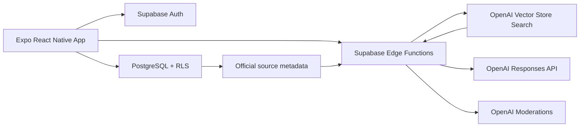

# K-Student Hub

> 한국에서 생활하는 외국인 유학생을 위한 학교 커뮤니티이자, 공식 출처 기반 체류정보 안내 앱입니다.

K-Student Hub는 외국인 유학생이 겪는 두 가지 문제를 한 앱에서 해결하려는 iOS·Android 프로젝트입니다.

- 같은 학교 유학생에게 생활 경험과 질문을 나눌 수 있습니다.
- 비자·체류·시간제취업처럼 정확성이 중요한 정보는 공식 출처와 함께 확인할 수 있습니다.

현재 저장소는 핵심 사용자 흐름을 직접 실행해 볼 수 있는 MVP입니다. 별도 백엔드 없이 동작하는 데모 모드와 Supabase·OpenAI를 연결하는 운영 모드를 함께 제공합니다.

## 프로젝트가 해결하려는 문제

외국인 유학생에게 필요한 정보는 학교 공지, 출입국기관, 정부 사이트, 온라인 커뮤니티에 흩어져 있습니다. 언어 장벽 때문에 최신 규정과 개인 경험을 구분하기도 어렵습니다.

K-Student Hub는 정보의 성격을 분리합니다.

- **커뮤니티:** 학생들의 경험, 질문, 생활 팁을 나누는 공간
- **공식정보:** 검수된 공식 문서를 근거로 답변하고 출처를 표시하는 공간
- **Today:** 체류기간과 학교생활에 맞춰 놓치기 쉬운 일을 보여주는 공간

## 핵심 원칙

1. **공식 근거가 없으면 답을 만들지 않습니다.** 검색 근거가 부족하면 답변 대신 1345 또는 관할 출입국·외국인청 확인을 안내합니다.
2. **경험과 정책을 섞지 않습니다.** 커뮤니티 게시글은 학생 경험이며 공식 답변으로 취급하지 않습니다.
3. **사용자가 스스로 안전을 관리할 수 있어야 합니다.** 신고, 작성자 차단, 개인정보 감지, 콘텐츠 검사를 기본 흐름에 포함합니다.
4. **모바일 앱에 서버 비밀키를 넣지 않습니다.** OpenAI와 관리자 권한은 Supabase Edge Functions 안에서만 사용합니다.

## 현재 구현된 기능

| 영역 | 구현 내용 | 현재 상태 |
| --- | --- | --- |
| 인증 | 이메일 로그인 경계, Supabase OTP, 보안 세션 저장 | 데모·운영 경로 구현 |
| 온보딩 | 학교, D-2/D-4, 닉네임, 답변 언어, 정책 버전별 필수 동의 | 구현 |
| Today | 일정 추가, 완료, 내일 보기, 삭제, 진행률, 기기 저장 | 데모·운영 경로 구현 |
| 커뮤니티 | 검색·필터·정렬, 게시글·익명 댓글, 좋아요·저장, 내 글, 신고·차단·삭제 | 데모·운영 경로 구현 |
| 안전 | 개인정보 패턴 감지, 신고, 작성자 차단, AI Moderation | 구현 |
| 공식정보 | 좌우 말풍선 채팅, 대화 문맥, 체크리스트, 공식 원문 링크, 근거 없음 상태, 1345 안내 | 데모·RAG 서버 경계 구현 |
| 내 정보 | 프로필 편집, 서비스 설정, 정책 동의 기록, 데모 초기화, 계정 삭제 | 구현 |
| 고객지원 | FAQ, 개인정보 입력 방지, 1:1 문의 접수와 상태 조회 | 데모·운영 경로 구현 |
| 백엔드 | PostgreSQL 스키마, RLS, seed, Edge Functions | 구현 |
| 배포 | Expo/EAS 개발·미리보기·운영 프로필 | 설정 완료 |

데모 모드의 게시글, 댓글, 좋아요, 북마크, 신고, 차단, 개인 일정, 프로필, 정책 동의, 서비스 설정과 문의내역은 기기에 저장됩니다. 운영 모드에서는 같은 동작이 Supabase와 RLS를 통해 사용자별로 저장됩니다. 내 정보의 **데모 데이터 초기화**는 로그인과 프로필을 유지한 채 커뮤니티·일정만 초기 상태로 되돌립니다.

## 주요 사용자 흐름

```text
시작 화면
  → 이메일 로그인
  → 학교·체류자격·언어 설정
  → Today 맞춤 체크리스트
  → 학교 또는 전체 커뮤니티
  → 글 작성·상세 보기·신고·차단
  → 공식정보 질문·답변·출처 확인
```

## 아키텍처



공식정보 답변은 다음 안전 경계를 통과합니다.

1. 로그인 사용자를 확인합니다.
2. OpenAI Vector Store에서 문서를 검색합니다.
3. 관련도 기준보다 낮은 결과를 제거합니다.
4. `official_sources`에서 사람이 승인했고 현재 유효한 활성 파일만 허용합니다.
5. 최근 대화 문맥과 검색된 공식 문서만 사용해 구조화된 답변을 생성합니다.
6. 모델이 실제 사용했다고 반환한 파일 ID를 서버에서 다시 검증합니다.
7. 검증된 발행기관·문서명·검수일·버전·원문 링크만 사용자에게 표시합니다.
8. 근거가 부족하면 `no_official_source`를 반환합니다.

자세한 설계는 [아키텍처 문서](docs/architecture.md)를 참고하세요.

## 기술 스택

| 구분 | 기술 |
| --- | --- |
| 앱 | Expo SDK 57, React Native, TypeScript, Expo Router |
| 상태·폼 | TanStack Query, React Hook Form, Zod |
| 다국어 | i18next, react-i18next, Expo Localization |
| 인증·DB | Supabase Auth, PostgreSQL, Row Level Security |
| 서버 | Supabase Edge Functions |
| AI | OpenAI Responses API, Vector Store Search, Moderations |
| 배포 | EAS Build, EAS Submit |

## 저장소 구조

```text
k-student-hub/
├─ apps/
│  ├─ mobile/                    # Expo iOS·Android·Web 앱
│  └─ admin/                     # 관리자 콘솔 구현 경계
├─ supabase/
│  ├─ migrations/               # DB 스키마와 RLS
│  ├─ functions/                # RAG, moderation, 계정 삭제
│  └─ seed.sql                  # 대학·공식 출처·일정 seed
├─ config/official-sources.json # 검수 전 공식 출처 레지스트리
├─ scripts/                     # 승인 문서 다운로드·색인 도구
├─ docs/                         # 운영·정책·배포 문서
├─ .env.example
├─ package.json
└─ pnpm-workspace.yaml
```

## 로컬에서 빠르게 실행하기

### 1. 준비물

- Git
- 현재 LTS 버전의 Node.js
- Corepack 또는 pnpm 11
- 모바일 테스트 시 Expo Go가 설치된 iOS/Android 기기 또는 Android Studio 에뮬레이터

pnpm이 없다면 먼저 활성화합니다.

```bash
corepack enable
corepack prepare pnpm@11.19.0 --activate
```

### 2. 저장소 받기

```bash
git clone https://github.com/heeahan/k-student-hub.git
cd k-student-hub
pnpm install
```

### 3. 데모 모드 실행

데모 모드는 Supabase나 OpenAI 키가 필요하지 않습니다.

```bash
pnpm mobile
```

Expo 개발 서버가 열리면 다음 방법 중 하나를 선택합니다.

- **실제 iOS/Android 기기:** Expo Go로 터미널의 QR 코드를 스캔합니다.
- **Android 에뮬레이터:** 터미널에서 `a`를 누릅니다.
- **iOS 시뮬레이터:** macOS에서 `i`를 누릅니다.
- **웹 브라우저:** 터미널에서 `w`를 누르거나 `pnpm mobile:web`을 실행합니다.

Windows에서는 iOS 시뮬레이터를 직접 실행할 수 없습니다. iPhone 실기기의 Expo Go 또는 EAS 클라우드 빌드를 사용하세요.

### 4. 데모 테스트 시나리오

다음 순서로 핵심 기능을 확인할 수 있습니다.

1. 시작 화면에서 **시작하기**를 누릅니다.
2. 미리 입력된 이메일로 데모 로그인합니다. 실제 메일은 발송되지 않습니다.
3. 닉네임, 학교, D-2/D-4, 답변 언어를 선택하고 정책 전문을 확인한 뒤 필수 동의합니다.
4. Today 화면에서 개인 일정을 추가하고 완료·내일 보기·삭제가 동작하는지 확인합니다.
5. 커뮤니티에서 내 학교·전체·저장글·내 글과 카테고리, 검색, 정렬을 바꿉니다.
6. 새 글을 작성하고 상세 화면으로 이동하는지 확인합니다.
7. 댓글과 익명 댓글을 작성하고 좋아요·북마크 상태가 유지되는지 확인합니다.
8. 본인의 글·댓글 삭제와 다른 사용자의 글·댓글 신고, 작성자 차단을 확인합니다.
9. 공식정보 탭에서 질문하고 답변·체크리스트·출처가 표시되는지 확인합니다.
10. 내 정보에서 닉네임·학교·체류자격·답변 언어를 편집합니다.
11. 페이지를 새로고침해 커뮤니티 활동과 개인 일정이 유지되는지 확인합니다.
12. 내 정보의 서비스 설정에서 알림·익명 기본값과 정책 동의 기록을 확인합니다.
13. 고객지원에서 FAQ를 열고 1:1 문의를 접수해 내 문의내역에 표시되는지 확인합니다.
14. 내 정보에서 데모 데이터 초기화, 로그아웃, 계정 삭제 흐름을 확인합니다.

## 자주 사용하는 명령

프로젝트 루트에서 실행합니다.

| 명령 | 설명 |
| --- | --- |
| `pnpm mobile` | Expo 개발 서버 시작 |
| `pnpm mobile:web` | 웹 개발 서버 시작 |
| `pnpm typecheck` | TypeScript 검사 |
| `pnpm lint` | ESLint 검사 |
| `pnpm export:web` | 정적 웹 번들 생성 |

플랫폼 명령은 `apps/mobile`에서 직접 실행할 수도 있습니다.

```bash
cd apps/mobile
pnpm android
pnpm ios
pnpm web
```

## 자동 검사

Pull Request 또는 기능 구현 후 최소한 다음 검사를 실행합니다.

```bash
pnpm typecheck
pnpm lint
pnpm export:web
```

현재 MVP는 위 검사와 모바일 크기 웹 화면에서 다음 상호작용을 통과했습니다.

- 로그인 및 온보딩
- Today 체크리스트
- 학교 커뮤니티 피드
- 게시글 작성과 상세 보기
- 신고·차단 진입점
- 공식정보 답변과 출처 표시

## Supabase 운영 모드 연결

### 1. 프로젝트 설정

1. Supabase 프로젝트를 생성합니다.
2. `supabase/migrations/202608310001_initial_schema.sql`을 적용합니다.
3. `supabase/migrations/202609010001_official_info_upgrade.sql`을 적용합니다.
4. `supabase/migrations/202609010002_community_upgrade.sql`을 적용합니다.
5. `supabase/seed.sql`을 적용합니다.
6. Auth Redirect URL에 `kstudenthub://`를 등록합니다.

### 2. 모바일 공개 환경변수

루트 예제 파일을 복사합니다.

macOS/Linux:

```bash
cp .env.example apps/mobile/.env
```

Windows PowerShell:

```powershell
Copy-Item .env.example apps/mobile/.env
```

`apps/mobile/.env`에는 공개 가능한 값만 입력합니다.

```dotenv
EXPO_PUBLIC_SUPABASE_URL=https://YOUR_PROJECT.supabase.co
EXPO_PUBLIC_SUPABASE_PUBLISHABLE_KEY=YOUR_PUBLISHABLE_KEY
EXPO_PUBLIC_USE_DEMO_DATA=false
```

`OPENAI_API_KEY`와 `SUPABASE_SERVICE_ROLE_KEY`는 모바일 `.env`에 절대 넣지 마세요.

### 3. Edge Functions 배포

Supabase CLI 로그인과 프로젝트 연결 후 실행합니다.

```bash
supabase functions deploy official-answer
supabase functions deploy moderate-content
supabase functions deploy delete-account
```

OpenAI 관련 값은 Supabase Function Secrets로 설정합니다.

```bash
supabase secrets set OPENAI_API_KEY=YOUR_KEY
supabase secrets set OPENAI_MODEL=gpt-5-mini
supabase secrets set OPENAI_VECTOR_STORE_ID=YOUR_VECTOR_STORE_ID
supabase secrets set RAG_MIN_SCORE=0.45
```

공식 문서를 Vector Store에 올리는 것만으로는 답변에 사용되지 않습니다. `config/official-sources.json`에서 현행성·재이용 조건을 사람이 검수한 후 `reviewStatus=approved`, `active=true`로 승인해야 하며, 파일 ID가 `official_sources.openai_file_id`에 연결되어야 합니다.

```powershell
pnpm.cmd sources:check
pnpm.cmd sources:ingest
```

자세한 절차는 [공식 출처 등록 안내](docs/source-ingestion.md)를 참고하세요.

## iOS·Android 빌드 준비

실제 빌드 전에 `apps/mobile/app.json`의 예시 값을 소유한 식별자로 바꿉니다.

- `ios.bundleIdentifier`
- `android.package`
- Expo `owner`
- EAS `projectId`
- 앱 아이콘, 지원 이메일, 개인정보처리방침 URL

이후 `apps/mobile`에서 EAS 빌드를 실행할 수 있습니다.

```bash
npx eas-cli@latest build --platform all --profile preview
npx eas-cli@latest build --platform all --profile production
```

스토어 제출 전에는 [출시 체크리스트](docs/release-checklist.md)를 반드시 확인하세요.

## 보안과 개인정보 보호

- 모든 사용자 데이터 테이블에 RLS를 적용합니다.
- 공개 피드는 개인 프로필 전체를 조회하지 않고 게시용 표시 이름만 사용합니다.
- OpenAI 및 Supabase 관리자 키는 서버 함수에서만 사용합니다.
- 주민등록번호, 외국인등록번호, 전화번호, 계좌번호 형태를 게시 전에 탐지합니다.
- 운영 모드에서는 게시 전 OpenAI Moderations 검사를 추가로 실행합니다.
- 사용자는 앱 안에서 신고, 차단, 계정 삭제를 수행할 수 있습니다.
- 정책 문서 키·버전·동의 시각을 기록하고 버전이 변경되면 재동의를 요구합니다.
- 고객문의는 사용자별 RLS를 적용하고 신분증 번호·계좌번호·전화번호로 보이는 입력을 차단합니다.

이 앱의 공식정보 답변은 법률 상담이 아닙니다. 실제 신청이나 중요한 판단 전에는 표시된 공식 문서, 외국인종합안내센터 1345 또는 관할 출입국·외국인청에서 확인해야 합니다.

## 현재 제한과 로드맵

다음 항목은 후속 구현 범위입니다.

- 커뮤니티 댓글 실시간 구독과 페이지네이션
- 푸시 알림 전달, 토큰 갱신과 발송 실패 처리
- 대학 이메일 인증과 대학 목록 확대
- 신고 처리 및 공식 출처 관리를 위한 관리자 웹 콘솔
- 체류 만료일·입국일·졸업일을 기준으로 한 일정 자동 생성
- 로컬 Supabase 기반 RLS 통합 테스트
- 전체 언어 번역 검수, 스크린리더·동적 글꼴 실기기 검수, 분석 동의, 오류 모니터링

세부 상태는 [MVP 구현 현황](docs/mvp-status.md)에서 확인할 수 있습니다.

## 문서

- [개발 및 외부 서비스 설정](docs/setup.md)
- [아키텍처와 신뢰 경계](docs/architecture.md)
- [공식 출처 등록 절차](docs/source-ingestion.md)
- [MVP 구현 현황](docs/mvp-status.md)
- [출시 체크리스트](docs/release-checklist.md)
- [대고객 서비스 운영 계획](docs/service-operations-plan.md)
- [이용약관 초안](docs/terms-of-service-draft.md)
- [커뮤니티 가이드라인 초안](docs/community-guidelines-draft.md)
- [개인정보 처리방침 초안](docs/privacy-policy-draft.md)

## 기여하기

이슈를 먼저 등록해 문제와 변경 범위를 공유한 뒤 작은 단위의 Pull Request를 권장합니다. 기능 변경에는 가능한 경우 타입 검사와 린트 결과, UI 변경에는 iOS 또는 Android 확인 화면을 함께 남겨 주세요.

공식 출입국 정보의 추가·수정은 일반 콘텐츠 변경과 다르게 취급합니다. 반드시 발행기관, 원문 URL, 시행일, 확인일, 적용 체류자격과 문서 버전을 함께 기록해야 합니다.

---

K-Student Hub는 현재 **작동 가능한 첫 수직 기능과 운영 지향 기반**을 제공하는 MVP입니다. 검수되지 않은 정책 자료가 실제 서비스에 사용할 준비가 되었다는 의미는 아닙니다.
